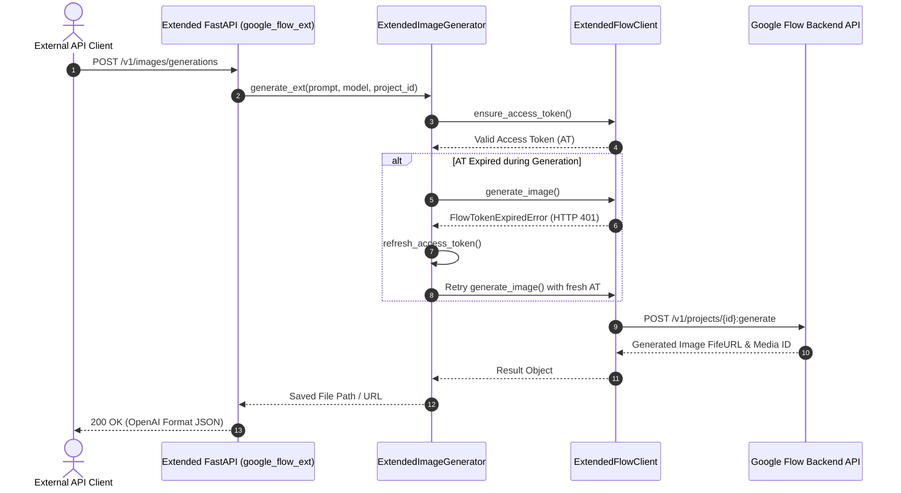

# `google_flow` Architecture & System Design Document

This document provides a comprehensive technical overview of the `google_flow` project architecture, its core components, data flow, and the **`google_flow_ext` Extension Layer**.

---

## 1. Design Goals & Architecture Philosophy

The `google_flow` ecosystem addresses three primary challenges when interfacing with the Google Flow portal:
1. **reCAPTCHA Bypass**: Managing automated browser runtimes (Playwright / nodriver) to generate and renew verification tokens in the background.
2. **Multi-Account Session Keep-Alive**: Intelligent token lifecycle management that monitors Access Token (AT) validity and automatically refreshes tokens before expiration.
3. **Seamless In-Process & API Integration**: Encapsulating low-level HTTP protocols behind a unified Python SDK (`FlowSDK`) and an OpenAI-compatible REST API server.

---

## 2. Core System Components

### A. Core SDK Interface: `FlowSDK`
The `FlowSDK` class (located in [google_flow/core/sdk.py](file:///c:/Users/ngkie/Downloads/google-flow-2.0.0/google_flow/core/sdk.py)) serves as the primary programmatic entry point:
- **Thread-Safe Context Management**: Using `async with FlowSDK(...)` isolates execution context and session configurations safely.
- **In-Process Captcha Integration**: Integrates directly with `InProcessCaptchaProvider` to solve captcha challenges locally without external HTTP bridge overhead.

### B. Low-Level HTTP Client: `FlowClient`
Located in [google_flow/core/client.py](file:///c:/Users/ngkie/Downloads/google-flow-2.0.0/google_flow/core/client.py):
- Manages HTTP session pooling (`curl_cffi` or `aiohttp`), authentication header injection, and typed error mapping (`FlowTokenExpiredError`, `FlowRateLimitError`, etc.).

### C. High-Level Orchestrator: `ImageGenerator`
Located in [google_flow/core/generator.py](file:///c:/Users/ngkie/Downloads/google-flow-2.0.0/google_flow/core/generator.py):
- Composes `FlowClient`, `SessionManager`, and retry policies to execute image generation, upscaling, and file saving workflows.

---

## 3. Extension Layer Architecture (`google_flow_ext`)

To preserve the base codebase (`google_flow`) 100% clean and untouched for upstream git compatibility, all custom enhancements reside inside the **`google_flow_ext`** package.

### Subclassed Core Entities:
- **`ExtendedFlowClient`**: Extends `FlowClient` to add dynamic project creation (`create_project`) and SHA-256 byte-hashed per-project media upload caching (`invalidate_media_cache`).
- **`ExtendedImageGenerator`**: Extends `ImageGenerator` to add automatic token refresh during retry attempts (`FlowTokenExpiredError`), multi-reference image support, and force re-upload fallback.
- **`ExtendedFlowSDK`**: Extends `FlowSDK` to initialize `ExtendedFlowClient` and `ExtendedImageGenerator`.
- **`ExtendedLoginSessionManager`**: Extends `LoginSessionManager` to provide multi-tier fallback cookie extraction for NextAuth session tokens in Playwright context.

---

## 4. Extended OpenAI-Compatible API Endpoints

The FastAPI server in `google_flow_ext/api/app.py` exposes:
- **`POST /v1/projects`**: Create new projects on Google Flow website.
- **`POST /v1/images/generations`**: Generate images with `project_id`, `project_title`, and `reference_media_id` support.
- **`POST /v1/images/edits`**: Image-to-Image multipart form upload for prompt-driven edits.
- **`POST /v1/chat/completions`**: Parses size preferences, aspect ratios, and reference images from message history.

---

## 5. Skeuomorphic Web Console

All web management interfaces inside `google_flow_ext/static/` utilize a **Skeuomorphic Design Language**:
- **Tactile 3D Controls**: Raised metallic buttons with dual-layer drop shadows and inset click depression.
- **Glowing LED Indicators**: Real-time status LEDs for API health, live token detection, and project readiness.
- **CRT / OLED Terminal Screens**: High-contrast monospace log screens with scanline overlay effects.

| Interface | Route | Description |
| :--- | :--- | :--- |
| **System Dashboard** | `GET /` | Hardware Rack Console for System Status & Token Sync |
| **Setup Wizard** | `GET /setup` | 3-Step Guided Setup & Login Terminal |
| **Captcha Admin** | `GET /admin` | Captcha Cluster Hardware Rack & Realtime CRT Logs |
| **User Console** | `GET /portal` | Commercial User Console with API Keys & Credit Gauge |

---

## 6. Sequence Diagrams

### Image Generation Sequence Flow

