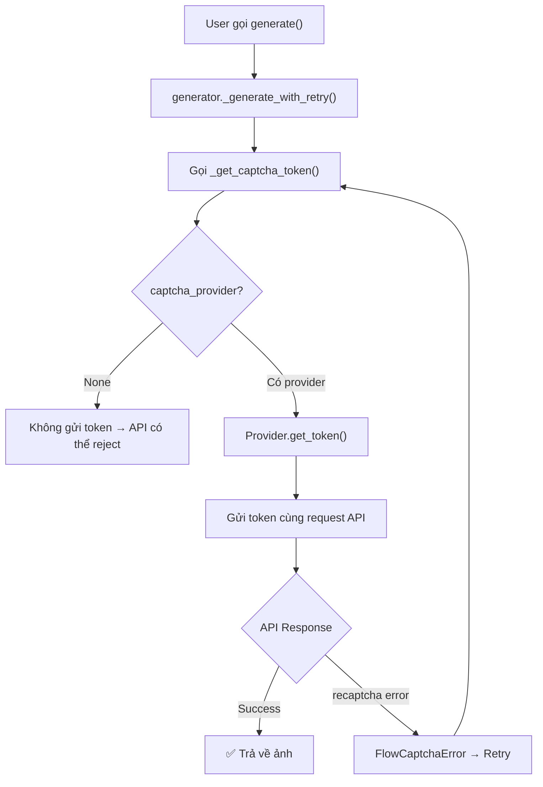

# 🔍 Phân tích reCAPTCHA trong Google Flow 2.0.0

## 1. Tổng quan vấn đề

Dự án **google-flow** là một unofficial API client cho Google Flow (labs.google/fx/tools/flow) — dịch vụ tạo ảnh AI của Google. Google sử dụng **reCAPTCHA Enterprise v3** để bảo vệ các API endpoint tạo ảnh và upscale ảnh. Điều này có nghĩa: **mỗi request tạo ảnh đều cần một reCAPTCHA token hợp lệ**, nếu không sẽ bị từ chối.

---

## 2. Cách reCAPTCHA được tích hợp trong hệ thống

### 2.1. Phía Google API (Server-side)

Khi gửi request tạo ảnh, API endpoint `batchGenerateImages` yêu cầu một `recaptchaContext` trong `clientContext`:

```json
{
  "clientContext": {
    "sessionId": "...",
    "projectId": "...",
    "tool": "PINHOLE",
    "recaptchaContext": {
      "token": "<reCAPTCHA_TOKEN>",
      "applicationType": "RECAPTCHA_APPLICATION_TYPE_WEB"
    }
  }
}
```

- **Site Key**: `6LdsFiUsAAAAAIjVDZcuLhaHiDn5nnHVXVRQGeMV` — hardcoded trong [constants.py](file:///c:/Users/ngkie/Downloads/google-flow-2.0.0/google-flow-2.0.0/google_flow/constants.py#L19)
- **Action**: `IMAGE_GENERATION` (cho tạo ảnh) hoặc tương tự cho upscale
- **Loại**: reCAPTCHA Enterprise v3 (score-based, không có checkbox)

### 2.2. Flow xử lý trong code



### 2.3. Các điểm then chốt trong code

| File | Vai trò |
|------|---------|
| [generator.py L190-197](file:///c:/Users/ngkie/Downloads/google-flow-2.0.0/google-flow-2.0.0/google_flow/core/generator.py#L190-L197) | `_get_captcha_token()` — lấy token từ provider, fallback `None` nếu fail |
| [generator.py L392-403](file:///c:/Users/ngkie/Downloads/google-flow-2.0.0/google-flow-2.0.0/google_flow/core/generator.py#L392-L403) | Trong `_attempt()` — captcha token được lấy **mỗi lần retry** |
| [client.py L356-404](file:///c:/Users/ngkie/Downloads/google-flow-2.0.0/google-flow-2.0.0/google_flow/core/client.py#L356-L404) | `generate_image()` — chèn `recaptchaContext` vào request body |
| [client.py L408-451](file:///c:/Users/ngkie/Downloads/google-flow-2.0.0/google-flow-2.0.0/google_flow/core/client.py#L408-L451) | `upsample_image()` — upscale cũng cần captcha token |
| [client.py L50-52](file:///c:/Users/ngkie/Downloads/google-flow-2.0.0/google-flow-2.0.0/google_flow/core/client.py#L50-L52) | `_classify_error()` — detect "recaptcha" trong error text → `FlowCaptchaError` |

---

## 3. Các Captcha Provider hiện có

Dự án cung cấp **4 cấp độ** giải captcha:

### 3.1. `NullCaptchaProvider` — Không dùng captcha
- File: [base.py](file:///c:/Users/ngkie/Downloads/google-flow-2.0.0/google-flow-2.0.0/google_flow/captcha/base.py#L23-L31)
- Luôn trả về `None` → request sẽ **không có captcha token**
- ⚠️ Với Google API hiện tại, request sẽ bị reject nếu server enforce captcha

### 3.2. `PlaywrightCaptchaProvider` — Browser-based, đơn giản
- File: [playwright_provider.py](file:///c:/Users/ngkie/Downloads/google-flow-2.0.0/google-flow-2.0.0/google_flow/captcha/playwright_provider.py)
- Mở một browser Playwright (Chromium/Chrome) → navigate đến `labs.google/fx/tools/flow/project/` → chờ `grecaptcha.enterprise` load → execute `grecaptcha.enterprise.execute()` để lấy token
- **Ưu điểm**: Đơn giản, chạy local
- **Nhược điểm**:
  - Cần session token (ST) đã login vào Google
  - Serial (dùng lock) → chỉ 1 request tại 1 thời điểm
  - Page reload mỗi 120 giây → chậm
  - Dễ bị Google detect là automation → score thấp → token bị reject

### 3.3. `InProcessCaptchaProvider` — In-process runtime
- File: [in_process_provider.py](file:///c:/Users/ngkie/Downloads/google-flow-2.0.0/google-flow-2.0.0/google_flow/captcha/in_process_provider.py)
- Chạy `CaptchaRuntime` (hệ thống captcha service) trực tiếp trong process
- Dùng cho SDK (`FlowSDK`) — tự động khởi tạo nếu không có provider nào được chỉ định

### 3.4. `BrowserCaptchaService` — Full captcha service
- File: [browser_captcha.py](file:///c:/Users/ngkie/Downloads/google-flow-2.0.0/google-flow-2.0.0/google_flow/captcha_service/services/browser_captcha.py) (5499 dòng!)
- Hệ thống phức tạp nhất với:
  - Pool browser instances
  - Fingerprint rotation
  - Standby token pool (pre-solve)
  - Project affinity
  - Error tracking & recovery
  - Docker support
- Có 2 mode: `browser` (Playwright) và `personal` (nodriver — undetected-chromedriver successor)

---

## 4. Vấn đề cốt lõi — Tại sao bị giới hạn bởi reCAPTCHA

### 4.1. reCAPTCHA Enterprise v3 Score
Google reCAPTCHA v3 trả về **score từ 0.0 đến 1.0** (1.0 = chắc chắn là người thật). Server-side của Google sẽ reject request nếu score quá thấp. Các yếu tố ảnh hưởng score:

| Yếu tố | Giải thích |
|---------|-----------|
| Browser fingerprint | Playwright/headless bị detect → score thấp |
| Behavioral patterns | Automated patterns (click quá nhanh, không có mouse movement) → score thấp |
| IP reputation | VPS/datacenter IP → score thấp |
| Request frequency | Quá nhiều request trong thời gian ngắn → score giảm |
| Cookie/Session age | Session mới tạo → score thấp |

### 4.2. Bottleneck cụ thể

1. **Single-threaded solving**: `PlaywrightCaptchaProvider` dùng `asyncio.Lock` → chỉ solve 1 captcha tại 1 thời điểm
2. **Token expiry**: reCAPTCHA token chỉ hợp lệ ~2 phút → phải solve mới mỗi request
3. **Page reload**: Page phải reload sau 120 giây → mất 2-5 giây/lần
4. **Detection**: Playwright dễ bị detect bởi anti-bot system → score thấp → token vô dụng
5. **No token caching**: Mỗi generate call = 1 captcha solve, không có pre-warming

---

## 5. Giải pháp đề xuất

### Solution A: Dùng `personal` mode với `nodriver` (Đề xuất chính)

> [!TIP]
> Đây là cách hiệu quả nhất vì `nodriver` (successor của `undetected-chromedriver`) khó bị detect hơn Playwright.

**Config** (trong `config.toml`):
```toml
[captcha]
method = "personal"          # Dùng nodriver thay vì playwright
personal_headless = false    # Headed mode → score cao hơn
personal_timeout = 90
personal_settle_seconds = 2.0
```

**Ưu điểm**:
- `nodriver` bypass được reCAPTCHA detection tốt hơn Playwright
- Resident tab pool → giữ tab browser mở sẵn → token gần như instant
- Config đã có sẵn trong `config.toml` hiện tại!

**Nhược điểm**:
- Cần Chrome/Chromium thật trên máy
- Headed mode → chiếm tài nguyên UI

---

### Solution B: Dùng `InProcessCaptchaProvider` qua SDK

Thay vì dùng `ImageGenerator` trực tiếp (như trong `interactive_generate.py`), dùng `FlowSDK`:

```python
async with FlowSDK(st_token="YOUR_ST") as sdk:
    result = await sdk.generate(prompt="...", model="...")
```

`FlowSDK` tự động tạo `InProcessCaptchaProvider` → chạy `CaptchaRuntime` → dùng `BrowserCaptchaService` (personal mode) → giải captcha hiệu quả hơn.

---

### Solution C: Chạy Captcha Service riêng biệt (cho production/multi-account)

Hệ thống đã có sẵn `captcha_service` module — một FastAPI server hoàn chỉnh:

1. Chạy captcha service server:
   ```bash
   python -m google_flow.captcha_service.main
   ```
2. Service cung cấp API endpoint `/api/v1/solve` để lấy token
3. Hỗ trợ cluster mode (master-worker), nhiều browser instance song song
4. Hỗ trợ quota management, session tracking

---

### Solution D: Tích hợp YesCaptcha (dịch vụ bên thứ ba)

Dự án đã tích hợp sẵn [YesCaptcha API compatibility](file:///c:/Users/ngkie/Downloads/google-flow-2.0.0/google-flow-2.0.0/google_flow/captcha_service/api/yescaptcha.py) — có thể dùng dịch vụ giải captcha bên ngoài (có phí) nếu cần throughput cao.

---

### Solution E: Bypass reCAPTCHA check (workaround)

> [!CAUTION]
> Giải pháp này chỉ hoạt động nếu Google API không enforce captcha nghiêm ngặt.

Trong [generator.py L190-197](file:///c:/Users/ngkie/Downloads/google-flow-2.0.0/google-flow-2.0.0/google_flow/core/generator.py#L190-L197), khi captcha provider fail, code chỉ log warning và trả `None`:

```python
async def _get_captcha_token(self, project_id: str) -> str | None:
    if self._captcha_provider is None:
        return None
    try:
        return await self._captcha_provider(project_id, "IMAGE_GENERATION")
    except Exception as exc:
        logger.warning("Captcha token acquisition failed (%s). Proceeding without captcha.", exc)
        return None
```

Và trong [client.py L379-383](file:///c:/Users/ngkie/Downloads/google-flow-2.0.0/google-flow-2.0.0/google_flow/core/client.py#L379-L383), nếu token là `None`, `recaptchaContext` sẽ không được gửi:

```python
if recaptcha_token:
    ctx["recaptchaContext"] = {
        "token": recaptcha_token,
        "applicationType": "RECAPTCHA_APPLICATION_TYPE_WEB",
    }
```

→ Nếu Google API tạm thời không enforce captcha (ví dụ cho một số model hoặc account type), request vẫn có thể thành công. Nhưng **đây không phải giải pháp lâu dài**.

---

## 6. Recommendation (Tóm tắt)

| Ưu tiên | Giải pháp | Độ khó | Hiệu quả | Ghi chú |
|---------|----------|--------|----------|---------|
| 🥇 | **A: `personal` mode + nodriver** | Thấp | Cao | Đã config sẵn! Chỉ cần cài nodriver |
| 🥈 | **B: Dùng `FlowSDK`** | Thấp | Cao | Thay đổi cách gọi API |
| 🥉 | **C: Captcha Service riêng** | Trung bình | Rất cao | Cho multi-account, production |
| 4 | **D: YesCaptcha** | Thấp | Cao | Tốn phí dịch vụ bên thứ ba |
| 5 | **E: Bỏ captcha** | Rất thấp | Không ổn định | Chỉ khi API không enforce |

> [!IMPORTANT]
> **Khuyến nghị**: Thử Solution A trước — config hiện tại đã set `method = "personal"` trong `config.toml`. Đảm bảo:
> 1. Cài `nodriver`: `pip install nodriver`
> 2. Có Chrome/Chromium trên máy
> 3. Set `personal_headless = false` (headed mode cho score cao)
> 4. Sử dụng `FlowSDK` (Solution B) thay vì gọi `ImageGenerator` trực tiếp
