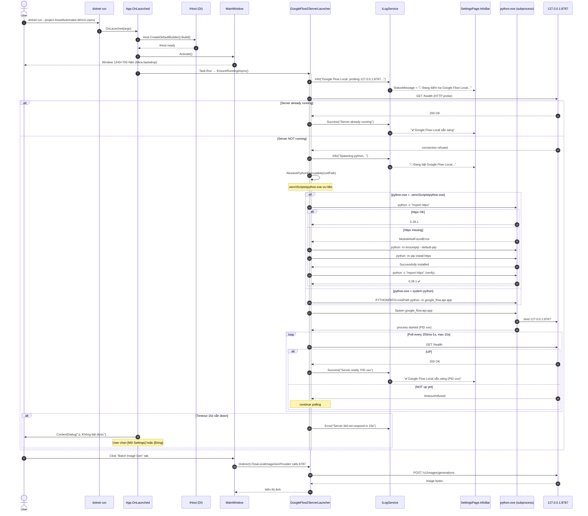
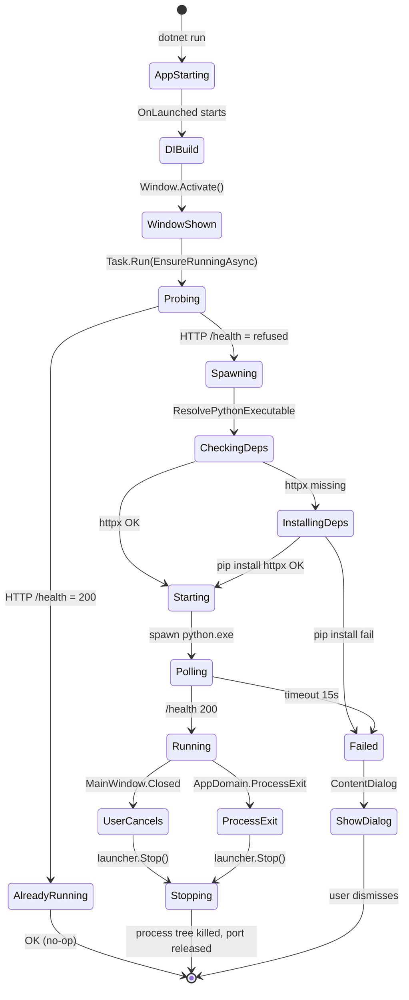
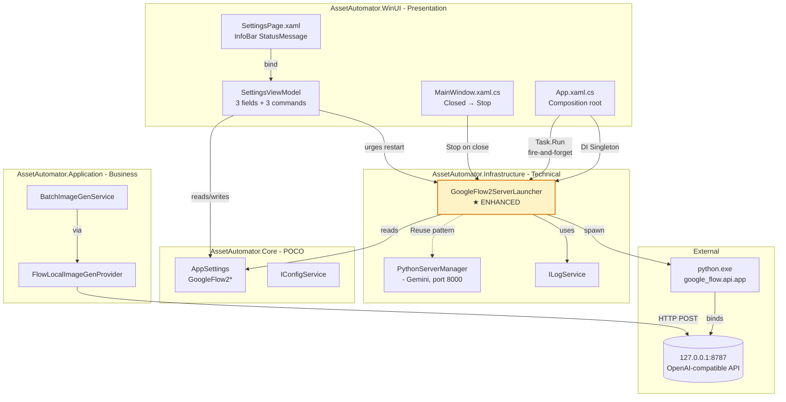
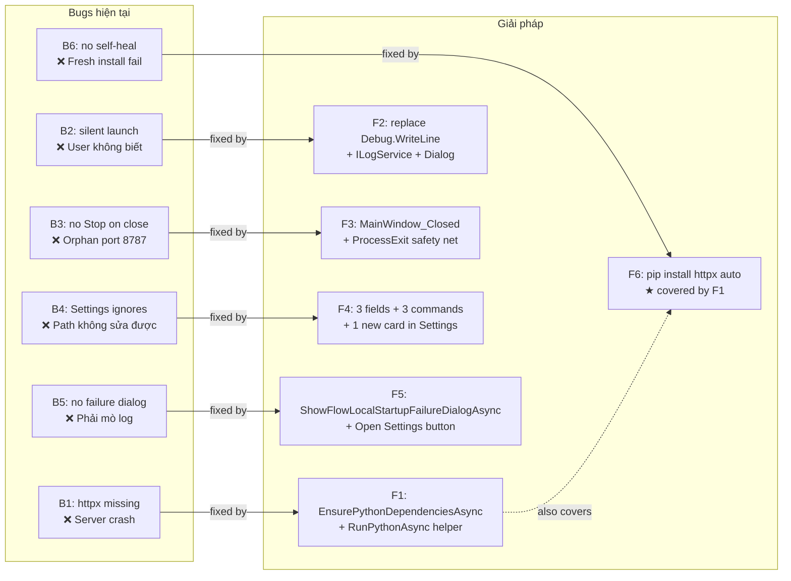
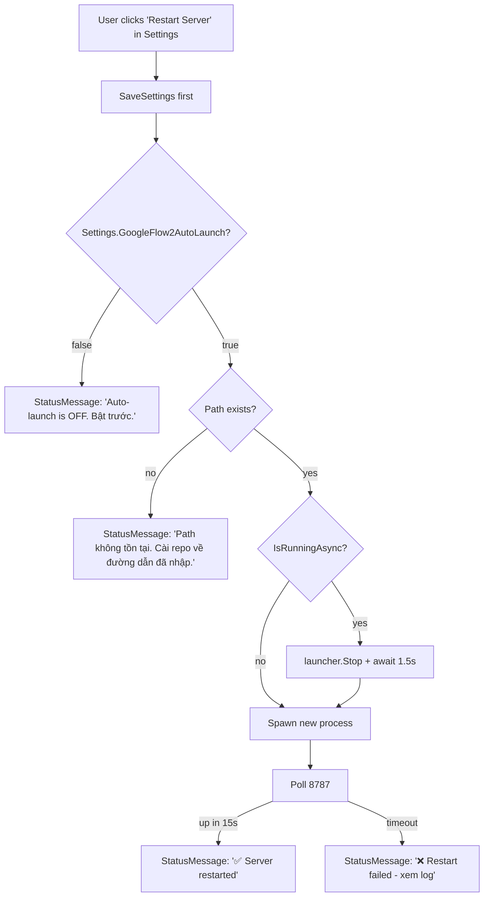
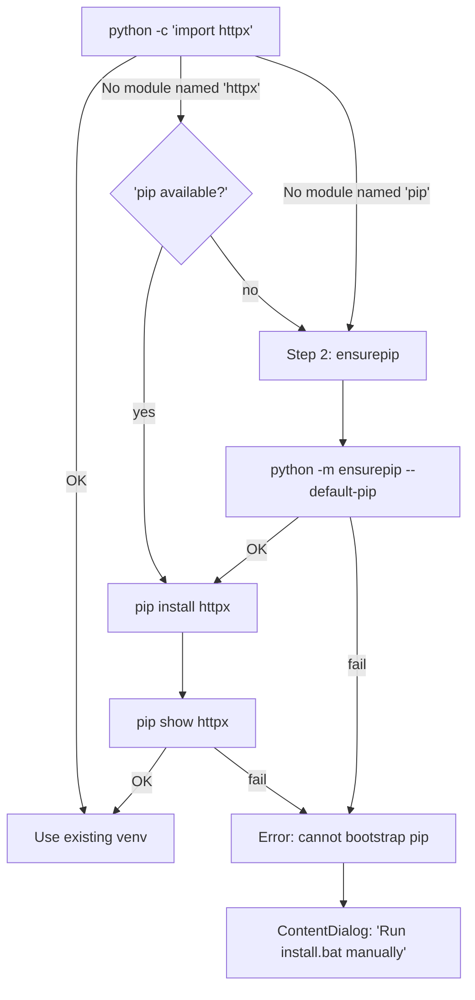
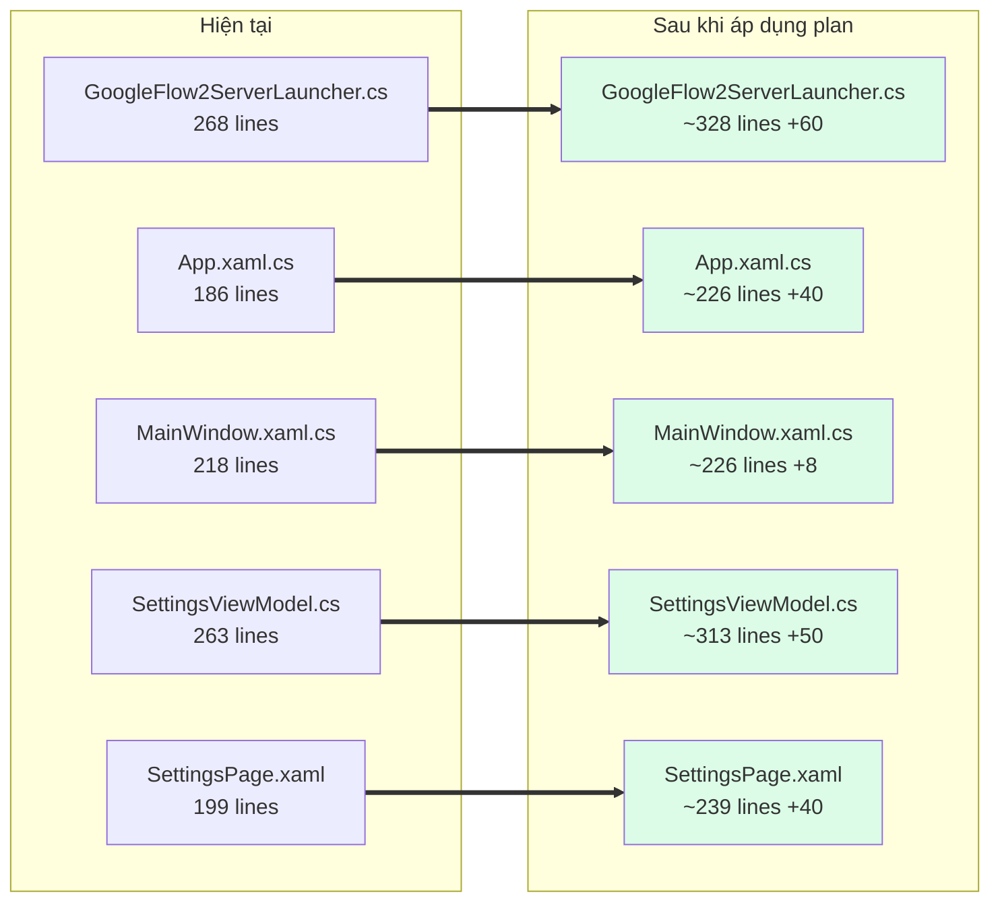

# Flow Diagram — Auto-start Google Flow Local khi `dotnet run`

> Companion doc cho `PLAN-FlowLocal-AutoStart.md`. Mermaid syntax — render trên GitHub hoặc VS Code extension `Markdown Preview Mermaid Support`.

---

## 1. Big-picture flow (khởi động app → server ready)

---

## 2. Lifecycle flow (start → running → stop)

---

## 3. Component diagram (kiến trúc)

---

## 4. Fix mapping (bug → giải pháp)

---

## 5. User-visible timeline (UX)

```mermaid
gantt
    title Auto-start Google Flow Local — User Experience Timeline
    dateFormat  X
    axisFormat %S s

    section App
    dotnet run spawn                   :a1, 0, 1s
    DI build + host start              :a2, after a1, 1s
    Window 1240×700 activate           :crit, a3, after a2, 1s

    section Flow Local
    Probe /health (background)         :b1, 0, 0.5s
    Spawn python.exe (if needed)       :b2, after b1, 0.5s
    Install httpx (if missing)         :b3, after b2, 30s
    Cold start uvicorn                 :b4, after b2, 8s
    Server ready on 8787               :crit, b5, after b4, 0s

    section UI Feedback
    InfoBar "🔄 Đang bật..."           :c1, 0, 1s
    InfoBar "✅ Sẵn sàng"              :c2, after b5, 0s
    ContentDialog (if fail)            :c3, after b4, 0s
```

**Happy path total**: ~2s (server đã up sẵn) → ~10s (cold start) → ~35s (cold start + httpx install lần đầu).

---

## 6. Decision tree — Settings "Restart Server" button

---

## 7. Self-healing — pip install httpx edge cases

---

## 8. Files modified (visual)

**Total delta**: ~198 LOC, **0 files mới**, **0 dependency mới**, **0 project mới**.

---

## 9. Render trong IDE

Các diagram ở trên dùng **Mermaid** — render ngay trong:

- **VS Code**: cài extension `Markdown Preview Mermaid Support` (bcmartins.vscode-mermaid)
- **GitHub**: render tự động khi xem file `.md` trên repo
- **Cursor**: render trong preview pane

Nếu bạn muốn file PNG/SVG, nói tôi export bằng `mmdc` (Mermaid CLI).
