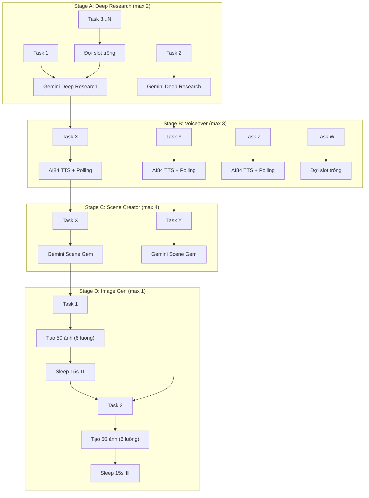

# 📖 Tài Liệu Hướng Dẫn & Kiến Trúc Hoạt Động: Gemini AI Creator

Tài liệu này giải thích chi tiết kiến trúc tổng quan và quy trình xử lý **5 bước (5-Step Pipeline)** của công cụ **Gemini AI Creator** trong dự án **AssetAutomator**.

---

## ⚙️ 1. Tổng Quan Kiến Trúc

**Gemini AI Creator** là quy trình tự động hóa sản xuất Video ngắn/dài toàn diện dựa trên mô hình **Gemini AI (Google DeepMind)** kết hợp với **AI84 / ElevenLabs TTS** và các **Provider sinh ảnh AI (FLUX / Glabs)**.

```
[Nhập Chủ Đề / Link YouTube]
         │
         ▼
┌────────────────────────────────────────────────────────┐
│  STEP 1: Deep Research (Report) ➔ Script (Transcript)   │ ──► Xuất: research_report.txt, transcript.txt
└────────────────────────┬───────────────────────────────┘
                         │
                         ▼
┌────────────────────────────────────────────────────────┐
│  STEP 2: Tạo Giọng Đọc & Phụ Đề (AI84/ElevenLabs)      │ ──► Xuất: audio.mp3, subtitles.srt
└────────────────────────┬───────────────────────────────┘
                         │
                         ▼
┌────────────────────────────────────────────────────────┐
│  STEP 3: Phân Cảnh & Prompt Ảnh (Gemini Scene Gem)    │ ──► Xuất: scenes.json
└────────────────────────┬───────────────────────────────┘
                         │
                         ▼
┌────────────────────────────────────────────────────────┐
│  STEP 4: Sinh Ảnh Cảnh Hàng Loạt (+ Character Ref)    │ ──► Xuất: img/scene_01.png, img/scene_02.png...
└────────────────────────┬───────────────────────────────┘
                         │
                         ▼
┌────────────────────────────────────────────────────────┐
│  STEP 5: Đóng Gói Tài Nguyên & Hoàn Tất (Export)       │ ──► Thư mục: Outputs/<id_task>/ (img/)
└────────────────────────┴───────────────────────────────┘
```

---

## 🔍 2. Chi Tiết Các Bước Trong Quy Trình (5-Step Workflow)

### 🔴 STEP 1: Gemini Deep Research & Tạo Kịch Bản (`GeminiTopicResearchStep`)
* **Mục đích**: Nghiên cứu sâu về chủ đề đầu vào và chuyển đổi báo cáo nghiên cứu thành kịch bản Video hoàn chỉnh.
* **Đầu vào**:
  * **Chủ Đề / Link YouTube**: Tên chủ đề hoặc URL video tham khảo.
  * **Scriptwriter Gem ID**: Tùy chọn Custom Gem chuyên viết kịch bản.
  * **Enable Deep Research (Bật/Tắt)**: Cho phép Gemini nghiên cứu đa chiều trên Web.
* **Cách hoạt động (Quy trình 2 Prompt khi bật Deep Research)**:
  1. **Prompt 1 (Nghiên cứu sâu)**: Gửi request tới Gemini Gem để tổng hợp một bản **Báo cáo nghiên cứu chuyên sâu (Research Report)** chi tiết nhiều số liệu và góc nhìn. Bản report này được lưu thành file `research_report.txt`.
  2. **Prompt 2 (Chuyển đổi kịch bản)**: Nhận bản report trên và gửi tiếp prompt tiêu chuẩn:
     > *"Write a complete, high-quality script of approximately 1600 - 2000 words based on these guidelines. Remember: output ONLY the spoken words"*
  3. Trích xuất đúng lời đọc kịch bản thuần túy và lưu về máy.
* **Kết quả đầu ra**: File `research_report.txt` (bản nghiên cứu) và file `transcript.txt` (kịch bản lời đọc hoàn chỉnh).

---

### 🟡 STEP 2: Sinh Giọng Đọc Voiceover & Phụ Đề SRT (`VoiceoverGenerationStep`)
* **Mục đích**: Chuyển đổi kịch bản văn bản thành file âm thanh Voiceover chất lượng cao và tạo file phụ đề SRT tương ứng.
* **Đầu vào**:
  * File `transcript.txt` từ Step 1.
  * **Voice ID**: Mã giọng đọc chọn từ thư viện AI84 / ElevenLabs.
  * **AI84 API Key**: Được cấu hình sẵn trong phần Cài đặt.
* **Cách hoạt động**:
  1. Tách `transcript.txt` thành các đoạn văn bản tối ưu cho TTS.
  2. Gọi API **AI84 / ElevenLabs** để chuyển dòng đọc sang dạng sóng âm thanh (MP3).
  3. Ghép các tệp âm thanh thành file Voiceover duy nhất `audio.mp3`.
  4. Trích xuất mốc thời gian (timestamps) chính xác từng từ để xuất file phụ đề `subtitles.srt`.
* **Kết quả đầu ra**: File `audio.mp3` và `subtitles.srt`.

---

### 🟢 STEP 3: Phân Cảnh & Sinh Prompt Chi Tiết (`GeminiSceneBreakdownStep`)
* **Mục đích**: Chia nhỏ video thành các phân cảnh visual (scenes) khớp với mốc thời gian phụ đề và viết prompt minh họa cho AI Image Gen.
* **Đầu vào**:
  * File `transcript.txt` và `subtitles.srt`.
  * **Scene Creator Gem ID**: Custom Gem chuyên phân tích khung hình & tạo prompt ảnh nghệ thuật.
* **Cách hoạt động**:
  1. Gemini đọc toàn bộ kịch bản và dòng phụ đề theo thời gian.
  2. Tính toán chia kịch bản thành các Scene (mỗi cảnh kéo dài 3 - 6 giây).
  3. Với mỗi Scene, Gemini tự động viết một **Visual Image Prompt** tiếng Anh chi tiết (mô tả góc quay, ánh sáng, đối tượng, chất liệu, tâm trạng).
* **Kết quả đầu ra**: File cấu trúc `scenes.json` chứa thông tin chi tiết từng phân cảnh.

---

### 🔵 STEP 4: Sinh Ảnh Cảnh Hàng Loạt Kèm Character Reference (`SceneImageBatchStep`)
* **Mục đích**: Tự động gọi mô hình sinh ảnh AI để tạo hình ảnh minh họa chất lượng cao cho tất cả các cảnh, duy trì tính nhất quán nhân vật qua **Character Reference**.
* **Đầu vào**:
  * File `scenes.json` từ Step 3.
  * **Character Ref**: Ô nhập Character Reference (mô tả nhân vật / đường dẫn ảnh nhân vật mẫu) trực tiếp trên DataGrid UI để giữ nhân vật đồng nhất giữa các cảnh.
  * **Provider Sinh Ảnh**: Chọn giữa `flow_local` (Server FLUX/SD local) hoặc `glabs`.
* **Cách hoạt động**:
  1. Đọc danh sách các cảnh trong `scenes.json` và cấu hình **Character Ref**.
  2. Gửi đồng thời/tuần tự các Visual Prompts (kèm Character Reference) tới Server sinh ảnh (`ImageGenerationStep`).
  3. Tải về và lưu toàn bộ ảnh vào **thư mục con `img/`** (ví dụ: `img/scene_01.png`, `img/scene_02.png`...).
  4. Cập nhật đường dẫn ảnh trực tiếp vào file `scenes.json`.
* **Kết quả đầu ra**: Các file ảnh minh họa lưu trong thư mục con `img/` của task.

---

### 🟣 STEP 5: Đóng Gói Tài Nguyên & Hoàn Tất (`Export & Packaging`)
* **Mục đích**: Kiểm tra tính toàn vẹn của dữ liệu và xuất kết quả ra thư mục chỉ định theo `id_task`.
* **Cấu trúc thư mục xuất ra (`Outputs/<id_task>/`)**:
  ```
  📁 Outputs/<id_task>/
  ├── 📄 research_report.txt (Báo cáo nghiên cứu sâu nếu bật Deep Research)
  ├── 📄 transcript.txt      (Kịch bản lời đọc hoàn chỉnh)
  ├── 🎵 audio.mp3           (Giọng đọc Voiceover chuẩn)
  ├── 📜 subtitles.srt       (Phụ đề SRT đồng bộ thời gian)
  ├── 📊 scenes.json         (Cấu trúc dữ liệu phân cảnh & prompt)
  └── 📁 img/                (Thư mục con chứa bộ ảnh AI minh họa)
      ├── 🖼️ scene_01.png
      ├── 🖼️ scene_02.png
      └── ...
  ```
* **Cập nhật giao diện**: Đổi Badge trạng thái thành **`✔️ Hoàn thành`** và cho phép ấn nút `Assets` để mở xem `scenes.json` hoặc mở thư mục output ngay lập tức.

---

## 🚀 3. Pipeline Orchestrator — Chạy Nhiều Task Song Song (Batch)

### 3.1 Tổng Quan

**Pipeline Orchestrator** (`Services/PipelineOrchestrator.cs`) là cơ chế chạy **nhiều task cùng lúc** theo mô hình **Assembly Line (Dây Chuyền Lắp Ráp)**. Mỗi task chạy độc lập qua 4 stage, mỗi stage có giới hạn slot riêng.

Khi bấm nút **"🚀 CHẠY TASK ĐÃ CHỌN"**, thay vì chạy tuần tự từng task (task 1 xong hết mới đến task 2), Pipeline Orchestrator cho phép các task **đan xen** vào nhau, tận dụng tối đa tài nguyên.

### 3.2 Mô Hình Ma Trận (Assembly Line)

```
                        6 Tasks chạy đồng thời
                    ─────────────────────────────►
          Task1   Task2   Task3   Task4   Task5   Task6
          ─────────────────────────────────────────────
Stage A:  [██]    [██]    [⏳]    [⏳]    [⏳]    [⏳]    ← max 2 slot
Stage B:  [⏳]    [⏳]    [⏳]    [⏳]    [⏳]    [⏳]    ← max 3 slot
Stage C:  [⏳]    [⏳]    [⏳]    [⏳]    [⏳]    [⏳]    ← max 4 slot
Stage D:  [⏳]    [⏳]    [⏳]    [⏳]    [⏳]    [⏳]    ← max 1 slot (tuần tự)
```

Khi Task1 hoàn thành Stage A, nó **ngay lập tức** nhảy xuống Stage B, và Task3 được phép vào Stage A:

```
          Task1   Task2   Task3   Task4   Task5   Task6
          ─────────────────────────────────────────────
Stage A:  [✔️]    [██]    [██]    [⏳]    [⏳]    [⏳]    ← 2/2
Stage B:  [██]    [⏳]    [⏳]    [⏳]    [⏳]    [⏳]    ← 1/3
Stage C:  [⏳]    [⏳]    [⏳]    [⏳]    [⏳]    [⏳]    ← 0/4
Stage D:  [⏳]    [⏳]    [⏳]    [⏳]    [⏳]    [⏳]    ← 0/1
```

### 3.3 Giới Hạn Slot Mỗi Stage

| Stage | Bước | Slot | Cơ Chế | Giải Thích |
|---|---|---|---|---|
| **A** | Deep Research & Transcript | **2** | `SemaphoreSlim(2)` | Tối đa 2 task gọi Gemini API cùng lúc. Các task còn lại xếp hàng chờ. |
| **B** | Voiceover AI84 (mp3 + srt) | **3** | `SemaphoreSlim(3)` | Tối đa 3 task gọi AI84 TTS API đồng thời. API AI84 có rate limit ~3-5 concurrent. |
| **C** | Scene Creator (scenes.json) | **4** | `SemaphoreSlim(4)` | Tối đa 4 task gọi Gemini Scene Creator cùng lúc. Step này nhẹ, có thể chạy nhiều. |
| **D** | Image Generation (Flow Local) | **1** | `SemaphoreSlim(1)` | **TUẦN TỰ TUYỆT ĐỐI**. Mỗi task tạo 50+ ảnh với 6 luồng song song nội bộ (`MaxConcurrentImages=6`). Sau khi xong, **nghỉ 15 giây** trước khi task tiếp theo vào. |

### 3.4 Luồng Xử Lý Chi Tiết



### 3.5 So Sánh: Chạy 1 Task vs Chạy Batch

| | Chạy 1 Task (`Run` button) | Chạy Batch (`CHẠY TASK ĐÃ CHỌN`) |
|---|---|---|
| **Engine** | `GeminiVideoPipelineService` (tuần tự 5 step) | `PipelineOrchestrator` (ma trận 4 stage song song) |
| **Deep Research** | 1 task tại 1 thời điểm | Tối đa 2 task cùng lúc |
| **Voiceover** | 1 task tại 1 thời điểm | Tối đa 3 task cùng lúc |
| **Scene Creator** | 1 task tại 1 thời điểm | Tối đa 4 task cùng lúc |
| **Image Gen** | 1 task, 6 ảnh song song | 1 task, 6 ảnh song song + sleep 15s giữa các task |
| **Thời gian 6 tasks** | ~90-180 phút (6 × 15-30 phút) | ~35-60 phút (các stage đan xen) |

### 3.6 Code Tham Khảo

```csharp
// Khởi tạo PipelineOrchestrator
var orchestrator = new PipelineOrchestrator(
    geminiApiService: _geminiApiService,
    maxDeepResearch: 2,   // 2 task deep research cùng lúc
    maxVoiceover: 3,      // 3 task voiceover cùng lúc
    maxSceneCreator: 4,   // 4 task scene creator cùng lúc
    maxImageGen: 1        // 1 task image gen (tuần tự, sleep 15s)
);

// Chạy batch
var result = await orchestrator.ExecuteBatchAsync(
    taskModels: selectedTasks,
    logTask: (taskModel, msg) => Dispatcher.Invoke(() =>
    {
        AppendGeminiTaskLog(taskModel, msg);
        UpdateTaskStepInfoFromLog(taskModel, msg);
    })
);

// Kết quả: ✅ 5/6 thành công, ❌ 1 thất bại — 42.3 phút
```

---

## 📊 4. Cấu Trúc File & Dependencies

| File | Vai Trò |
|---|---|
| `Services/PipelineOrchestrator.cs` | **MỚI** — Orchestrator cho batch multi-task |
| `Services/GeminiVideoPipelineService.cs` | Pipeline 5-step cho 1 task đơn lẻ |
| `Services/Steps/GeminiTopicResearchStep.cs` | Step 1 & 2: Deep Research + Transcript |
| `Services/Steps/VoiceoverGenerationStep.cs` | Step 3: Voiceover AI84 + SRT |
| `Services/Steps/GeminiSceneBreakdownStep.cs` | Step 4: Scene Creator JSON |
| `Services/Steps/SceneImageBatchStep.cs` | Step 5: Batch Image Generation (6 ảnh song song) |
| `Services/GeminiApiService.cs` | HTTP client tới Gemini Python REST Server |
| `Services/BatchImageGenService.cs` | Factory pattern cho Image Gen Provider |
| `Windows/MainWindow.GeminiCreator.cs` | UI code-behind (tab Gemini AI Creator) |
