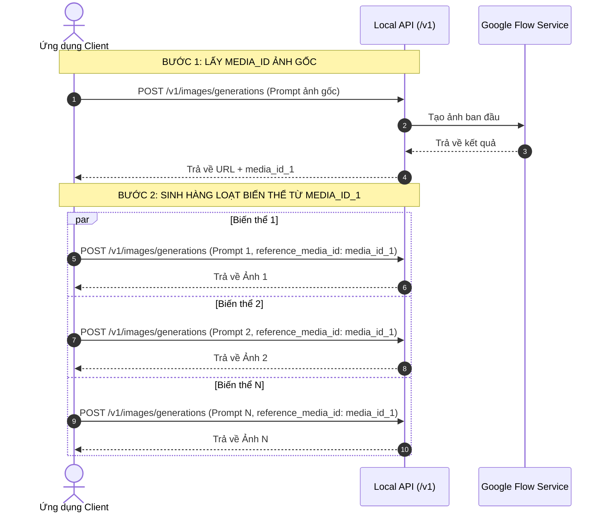

# Hướng Dẫn Tích Hợp Google Flow Image API (1-to-N Reference Image Generation)

Tài liệu này hướng dẫn cách tích hợp và khai thác hệ thống **Google Flow OpenAI-Compatible API** để sinh **nhiều ảnh biến thể từ 1 ảnh tham chiếu (1-to-N Image Generation)** một cách hiệu quả, tối ưu tài nguyên và tốc độ nhất.

---

## 1. Thông Tin Chung

- **Base URL**: `http://127.0.0.1:8787` (Mặc định local)
- **API Endpoint chính**: `/v1/images/generations` và `/v1/images/edits`
- **Authentication**: `Authorization: Bearer <API_KEY>` (Mặc định: `flow-local-key`)
- **Headers**:
  ```http
  Authorization: Bearer flow-local-key
  Content-Type: application/json
  ```

---

## 2. Nguyên Lý Xử Lý Luồng 1-to-N (Core Workflow)

Khi làm việc với ảnh tham chiếu (Image-to-Image / Style Transfer / Variations):

1. **Khái niệm `media_id`**: Mỗi khi một ảnh được tạo ra hoặc tải lên hệ thống Google Flow, server sẽ trả về thuộc tính `media_id` (Ví dụ: `135bf926-465d-47af-ab41-006a8d7b1f94`).
2. **Tái sử dụng `reference_media_id`**: Thay vì phải upload lại dữ liệu ảnh binary (vừa chậm vừa tốn băng thông) cho mỗi biến thể, bạn chỉ cần truyền chuỗi `reference_media_id` này cho các request tiếp theo.
3. **Sinh song song (Batching)**: Gửi song song $N$ request chứa cùng một `reference_media_id` nhưng kèm các prompt/style khác nhau.



---

## 3. Code Mẫu Tích Hợp (Integration Code Examples)

### 3.1. Python (Async - `httpx` & `asyncio`)

Ví dụ đầy đủ cách sinh $N$ ảnh biến thể từ 1 `reference_media_id` bằng Python:

```python
import asyncio
import sys
import httpx

# Cấu hình encoding hiển thị tiếng Việt trên Windows
if hasattr(sys.stdout, "reconfigure"):
    sys.stdout.reconfigure(encoding="utf-8")

BASE_URL = "http://127.0.0.1:8787"
HEADERS = {
    "Authorization": "Bearer flow-local-key",
    "Content-Type": "application/json"
}

# Giới hạn số request chạy đồng thời (Concurrency Limit)
MAX_CONCURRENT = 3
semaphore = asyncio.Semaphore(MAX_CONCURRENT)


async def generate_variant(client: httpx.AsyncClient, prompt: str, ref_media_id: str, index: int):
    """Gửi request sinh 1 ảnh biến thể từ reference_media_id."""
    async with semaphore:
        print(f"[Task {index}] Đang sinh ảnh: '{prompt}'...")
        payload = {
            "model": "gemini-3.1-flash-image-landscape",
            "prompt": prompt,
            "reference_media_id": ref_media_id,
        }
        res = await client.post(f"{BASE_URL}/v1/images/generations", json=payload)
        if res.status_code != 200:
            print(f"  └─ [ERROR Task {index}] Status {res.status_code}: {res.text}")
            return None

        data = res.json()
        item = data["data"][0]
        print(f"  └─ [OK Task {index}] URL: {item['url']} | media_id: {item.get('media_id')}")
        return item


async def main():
    # Lưu ý: Cần đặt timeout >= 60-120s vì AI image generation cần thời gian xử lý
    async with httpx.AsyncClient(headers=HEADERS, timeout=httpx.Timeout(120.0)) as client:
        
        # 1. Tạo ảnh gốc hoặc sử dụng media_id có sẵn
        print("1. Đang tạo ảnh tham chiếu ban đầu...")
        init_res = await client.post(
            f"{BASE_URL}/v1/images/generations",
            json={
                "model": "gemini-3.1-flash-image-landscape",
                "prompt": "A peaceful mountain lake at sunrise, digital art"
            }
        )
        
        if init_res.status_code != 200:
            print(f"[ERROR] Không thể khởi tạo ảnh gốc: {init_res.text}")
            return

        ref_media_id = init_res.json()["data"][0].get("media_id")
        print(f"==> Đã có reference_media_id: {ref_media_id}\n")

        # 2. Định nghĩa danh sách biến thể cần tạo
        prompts = [
            "Biến khung cảnh thành mùa đông tuyết rơi phủ trắng",
            "Biến khung cảnh thành phong cách Cyberpunk về đêm với đèn neon",
            "Biến khung cảnh thành tranh vẽ màu nước Studio Ghibli",
            "Biến khung cảnh thành hoàng hôn rực rỡ với bầu trời màu cam tím"
        ]

        # 3. Chạy song song sinh N biến thể
        print(f"2. Đang sinh song song {len(prompts)} ảnh biến thể...")
        tasks = [
            generate_variant(client, prompt, ref_media_id, i + 1)
            for i, prompt in enumerate(prompts)
        ]
        results = await asyncio.gather(*tasks)
        
        valid_results = [r for r in results if r is not None]
        print(f"\n🎉 Hoàn thành sinh {len(valid_results)}/{len(prompts)} ảnh thành công!")


if __name__ == "__main__":
    asyncio.run(main())
```

---

### 3.2. JavaScript / Node.js (Fetch & `Promise.all`)

```javascript
const BASE_URL = 'http://127.0.0.1:8787';
const API_KEY = 'flow-local-key';

const headers = {
  'Authorization': `Bearer ${API_KEY}`,
  'Content-Type': 'application/json'
};

async function generateVariantsFromReference() {
  // 1. Tạo ảnh gốc để lấy media_id
  console.log('1. Đang tạo ảnh gốc...');
  const initRes = await fetch(`${BASE_URL}/v1/images/generations`, {
    method: 'POST',
    headers,
    body: JSON.stringify({
      model: 'gemini-3.1-flash-image-landscape',
      prompt: 'A peaceful mountain lake at sunrise, digital art'
    })
  });
  
  const initData = await initRes.json();
  const refMediaId = initData.data[0].media_id;
  console.log('==> reference_media_id:', refMediaId);

  // 2. Danh sách biến thể
  const prompts = [
    'Biến khung cảnh thành mùa đông tuyết rơi phủ trắng',
    'Biến khung cảnh thành phong cách Cyberpunk về đêm với đèn neon',
    'Biến khung cảnh thành tranh vẽ màu nước Studio Ghibli'
  ];

  // 3. Gọi song song
  console.log(`2. Đang sinh ${prompts.length} biến thể...`);
  const promises = prompts.map(async (prompt, idx) => {
    const res = await fetch(`${BASE_URL}/v1/images/generations`, {
      method: 'POST',
      headers,
      body: JSON.stringify({
        model: 'gemini-3.1-flash-image-landscape',
        prompt,
        reference_media_id: refMediaId
      })
    });
    const data = await res.json();
    console.log(`[Task ${idx + 1}] Completed:`, data.data[0].url);
    return data.data[0];
  });

  const results = await Promise.all(promises);
  console.log('🎉 Hoàn tất:', results);
}

generateVariantsFromReference();
```

---

### 3.3. cURL (Command Line)

**Bước 1: Sinh ảnh gốc**
```bash
curl http://127.0.0.1:8787/v1/images/generations \
  -H "Authorization: Bearer flow-local-key" \
  -H "Content-Type: application/json" \
  -d '{
    "model": "gemini-3.1-flash-image-landscape",
    "prompt": "A peaceful mountain lake at sunrise, digital art"
  }'
```
*Kết quả trả về chứa `"media_id": "135bf926-465d-47af-ab41-006a8d7b1f94"`.*

**Bước 2: Sinh biến thể từ `reference_media_id`**
```bash
curl http://127.0.0.1:8787/v1/images/generations \
  -H "Authorization: Bearer flow-local-key" \
  -H "Content-Type: application/json" \
  -d '{
    "model": "gemini-3.1-flash-image-landscape",
    "prompt": "Biến khung cảnh thành mùa đông tuyết rơi phủ trắng",
    "reference_media_id": "135bf926-465d-47af-ab41-006a8d7b1f94"
  }'
```

---

## 4. Các Lưu Ý Tối Ưu & Xử Lý Lỗi (Best Practices)

### 4.1. Tối ưu hóa Trình duyệt & Quản lý RAM
- Hệ thống đã tích hợp cơ chế **Singleton Browser**. Dù gửi bao nhiêu request song song, server sẽ chỉ duy trì **duy nhất 1 tiến trình Chrome ngầm** để giải reCAPTCHA, đảm bảo không bị quá tải RAM hay sinh nhiều tiến trình Chrome rác.

### 4.2. Cấu hình Timeout phía Client
- Do quá trình tạo ảnh AI có thể mất 15-40 giây, phía Client HTTP (như `httpx`, `axios`, `fetch`) **bắt buộc phải cấu hình Timeout tối thiểu từ 60s đến 120s**.

### 4.3. Xử lý lỗi 403 reCAPTCHA / Permission Denied
Nếu gặp lỗi `HTTP 403: reCAPTCHA evaluation failed`:
1. Trực tiếp mở trình duyệt và truy cập: **`http://127.0.0.1:8787/setup`**
2. Đăng nhập tài khoản Google Flow của bạn.
3. Trang Setup sẽ tự động đồng bộ lại Session Token và reCAPTCHA token về local server.

---

## 5. Danh Sách Các Model Hỗ Trợ (Available Models)

- `gemini-3.1-flash-image-landscape` (Tỷ lệ 16:9 - Khuyên dùng)
- `gemini-3.1-flash-image-portrait` (Tỷ lệ 9:16)
- `gemini-3.1-flash-image-square` (Tỷ lệ 1:1)
- `gemini-3.0-pro-image-landscape`
- `imagen-4.0-generate-preview-landscape`
- `nano-banana-2-landscape`
