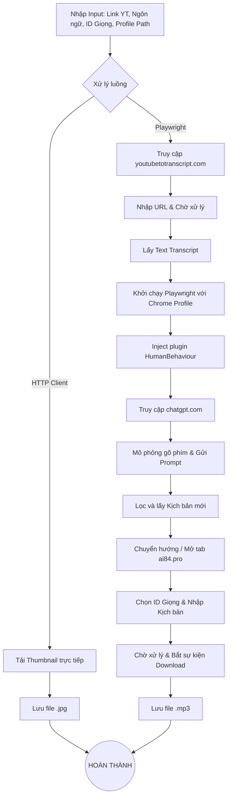

# YÊU CẦU KỸ THUẬT (PRD & TECH SPEC) - V2

- **Tên dự án:** Công cụ Tự động hóa Kịch bản & Voiceover YouTube (Full UI Automation)
- **Nền tảng:** Windows Desktop App (C# - WPF / WinForms)
- **Cốt lõi:** C# .NET, Playwright for .NET

## 1. Mục tiêu dự án

Xây dựng ứng dụng Windows Desktop tự động hóa hoàn toàn quy trình xử lý nội dung YouTube thông qua thao tác giao diện trình duyệt (UI Automation) bằng Playwright, từ việc lấy transcript, viết lại kịch bản qua ChatGPT bằng profile người dùng thật, đến việc tạo voiceover.

**Đầu vào (Input):**
- URL Video YouTube.
- Ngôn ngữ đích (Target Language).
- ID Giọng nói (Voice ID) trên hệ thống ai84.pro.
- Đường dẫn tới thư mục Chrome Profile của người dùng (chứa session ChatGPT).

## 2. Sơ đồ luồng xử lý (Flow Diagram)



## 3. Chi tiết các bước triển khai (Step-by-Step)

### Bước 1: Trích xuất và tải Thumbnail
- **Phương pháp:** Direct HTTP Request (Tối ưu tốc độ, không dùng Playwright).
- **Chi tiết:** Parse `VIDEO_ID` từ Link YouTube và tải ảnh từ `https://img.youtube.com/vi/<VIDEO_ID>/maxresdefault.jpg`.

### Bước 2: Lấy Transcript qua youtubetotranscript.com
- **Phương pháp:** C# Playwright.
- **Chi tiết:**
  - Mở trình duyệt (có thể dùng Headless hoặc không).
  - Điều hướng tới `https://youtubetotranscript.com/`.
  - Dùng Locator tìm ô nhập URL YouTube và điền link.
  - Click nút "Go" hoặc "Extract".
  - Sử dụng hàm wait (ví dụ: `WaitForSelectorAsync`) để chờ phần tử chứa nội dung transcript xuất hiện.
  - Trích xuất text (`InnerTextAsync`) và lưu vào biến bộ nhớ.

### Bước 3: Generate Kịch bản mới với ChatGPT (Sử dụng Profile & HumanBehaviour)
- **Phương pháp:** C# Playwright + `LaunchPersistentContextAsync` + Khởi tạo module `HumanBehaviour`.
- **Chi tiết kỹ thuật:**
  - **Load Profile:** Khởi chạy trình duyệt bằng đường dẫn thư mục User Data của Chrome.
    ```csharp
    var context = await playwright.Chromium.LaunchPersistentContextAsync(
        userDataDir: @"C:\Users\YourUser\AppData\Local\Google\Chrome\User Data",
        new BrowserTypeLaunchPersistentContextOptions { 
            Headless = false, // Bắt buộc False để tránh Cloudflare
            Channel = "chrome", // Dùng trình duyệt Chrome thật cài trên máy
            Args = new[] { "--disable-blink-features=AutomationControlled" } 
        });
    ```
  - **Triển khai plugin HumanBehaviour:** Xây dựng một class C# dạng tiện ích (Utility Class) chuyên xử lý hành vi:
    - `TypeLikeHumanAsync(string text)`: Thay vì dán text ngay lập tức, dùng vòng lặp duyệt qua từng ký tự, sử dụng `TypeAsync` với tham số delay ngẫu nhiên từ 30ms đến 150ms. Thỉnh thoảng mô phỏng việc gõ sai (backspace).
    - `RandomMouseMovementAsync()`: Sử dụng `Page.Mouse.MoveAsync` với các tọa độ ngẫu nhiên dạng đường cong (Bezier curve) trước khi click vào ô chat.
    - `RandomScrollAsync()`: Cuộn trang lên xuống ngẫu nhiên trước khi thực hiện hành động.
    - **Masking:** Chạy script `Page.AddInitScriptAsync` để xóa cờ `navigator.webdriver`.
  - **Thực thi:**
    - Áp dụng `HumanBehaviour` để nhập Prompt (bao gồm Transcript ở Bước 2) vào ô chat của ChatGPT.
    - Nhấn gửi và tạo logic vòng lặp để kiểm tra khi nào nút "Stop generating" biến mất (báo hiệu AI đã viết xong).
    - Trích xuất đoạn hội thoại cuối cùng (Last message response).

### Bước 4: Tạo Voiceover qua ai84.pro
- **Phương pháp:** C# Playwright (UI Automation).
- **Chi tiết:**
  - Tiếp tục sử dụng context ở Bước 3, mở tab mới (`NewPageAsync`) tới `ai84.pro`.
  - Chọn Voice ID, dùng `TypeLikeHumanAsync` để nhập kịch bản.
  - Bấm tạo và bắt sự kiện `WaitForDownloadAsync()`.
  - Lưu file `.mp3` về máy.

## 4. Rủi ro & Lưu ý Kỹ thuật (Technical Risks)

- **Xung đột Chrome Profile:** `LaunchPersistentContextAsync` yêu cầu trình duyệt Chrome thực tế PHẢI ĐANG TẮT. Nếu người dùng đang mở Chrome lướt web bằng profile đó, Playwright sẽ throw exception không thể lock thư mục profile. Cần có cơ chế cảnh báo người dùng đóng Chrome trước khi chạy Tool, hoặc tạo một bản copy của thư mục User Data để dùng riêng.
- **Bảo trì CSS Selector:** Trang `youtubetotranscript.com`, `chatgpt.com`, và `ai84.pro` sẽ thay đổi class/id liên tục. Bạn nên sử dụng các bộ chọn linh hoạt như dựa trên Text (VD: `GetByText("Send")`), Role (`GetByRole(AriaRole.Button)`), hoặc Regex thay vì dùng CSS selector cứng (VD: `.btn-primary-2`).
- **Quản lý RAM:** Do chạy UI Automation không headless cho nhiều trang web nặng, ứng dụng cần theo dõi Memory Leak. Phải dọn dẹp (Dispose) Playwright Context ngay sau khi lấy xong `.mp3`.